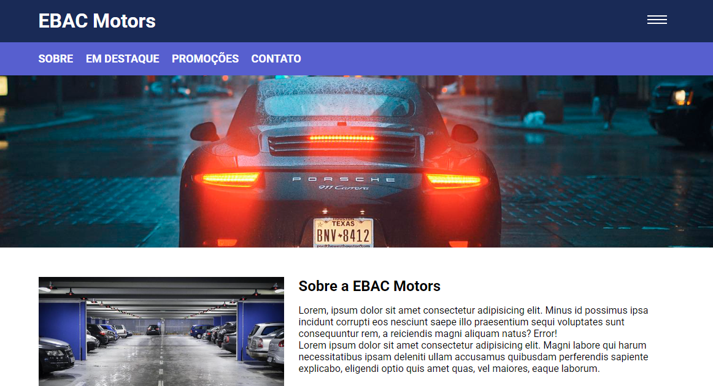

# Sobre o modulo jQuery

 Durante o modulo foi recaptulado o HTML, CSS & JS porem de uma forma mais agil de se utilizar ja que venho utilizando jquery. Aprimorei ainda mais com utilizações dos plugins fazendo máscara para campos input e também transações de efeito dentro do site conforme o usuario utiliza deixando mais suave e interativo.

Clique para ver 👇

    <a href="https://ebac-modulo-plugins-jquery.vercel.app/">
        </img>
    </a>

